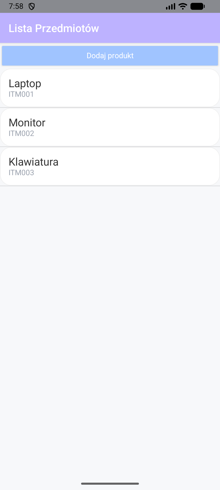
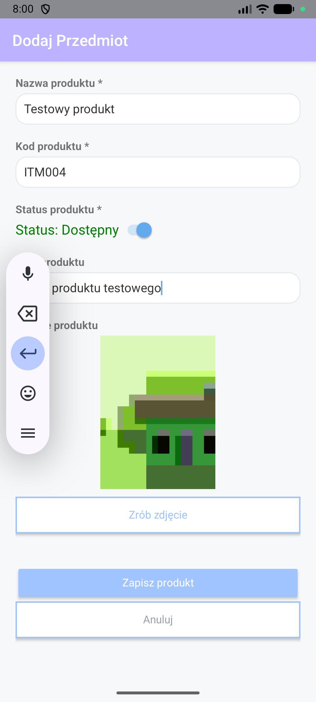
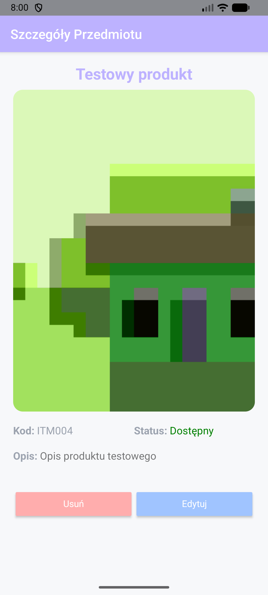

# NativeScript App - Inventory Scan

Aplikacja mobilna "Inventory Scan", stworzona w technologii NativeScript z frameworkiem Angular, służy do zarządzania stanami produktów/przedmiotów. Pozwala użytkownikowi na tworzenie bazy produktów wraz ze zdjęciami, kodami, opisami oraz ich statusem dostępności.

## Spełnione wymagania funkcjonalności

Aplikacja implementuje wszystkie kluczowe wymagania projektowe:

* **Implementacja Widoków (3):**
    1.  **Lista Produktów (`src/app/items/items.component.ts`):** Główny ekran wyświetlający listę wszystkich przedmiotów w formie kart. Zastosowano `GridLayout` dla pełnego wykorzystania ekranu.
    2.  **Szczegóły Produktu (`src/app/item-detail/item-detail.component.ts`):** Ekran wyświetlający: nazwę przedmiotu/produktu, jego zdjęcie, kod, Status oraz pełny opis. Widok szczegółowy zawiera przyciski akcji: **EDYTUJ** (przenosi do formularza) oraz **USUŃ** (usuwa wpis i wraca do listy).
    3.  **Formularz Dodaj/Edytuj (`src/app/item-add/item-add.component.ts`):** Uniwersalny formularz obsługujący dwie funkcje: tworzenie nowego wpisu oraz edycję istniejącego (rozpoznawanie po ID w routingu). Zawiera walidację wymaganych pól (Nazwa, Kod) oraz przełącznik statusu dostępności.

* **Zarządzanie Danymi**
    Aplikacja korzysta z serwisu `InventoryService`, który zarządza danymi w oparciu o `Observable`, realizując cykl CRUD:
    * **Create:** Dodawanie nowego obiektu do tablicy.
    * **Read:** Pobieranie listy oraz pojedynczego elementu po ID.
    * **Update:** Aktualizacja istniejącego wpisu.
    * **Delete:** Usuwanie istniejącego elementu z listy.

* **Funkcja Natywna** - `@nativescript/camera`
    1.  **Uzasadnienie wyboru:** W procesie inwentaryzacji wizualna stanu przedmiotu jest niezbędna do aplikacji tego typu.
    2.  **Implementacja:** Aplikacja obsługuje uprawnienia systemowe (Android Permissions), uruchamia natywny aparat urządzenia i przechwytuje zdjęcie jako `ImageAsset`. Zdjęcie jest następnie wyświetlane w podglądzie formularza oraz w szczegółach produktu.

## Technologie i Biblioteki

* **NativeScript 8+ & Angular 18+ (Standalone Components)**
* `@nativescript/camera` - obsługa aparatu.
* `@angular/router` - nawigacja i przekazywanie parametrów.
* `RxJS` - obsługa danych.

## Uruchamianie Projektu

Projekt został stworzony i testowany w środowisku **Windows 11** przy użyciu **Android Studio** (Emulator).

0.  Upewnij się, że masz zainstalowane **NativeScript CLI** oraz skonfigurowane zmienne środowiskowe.
1.  W folderze projektu `inventory-scan-app` zainstaluj zależności (jeśli to pierwsze uruchomienie):
    ```bash
    npm install
    ```
2.  Uruchom aplikację wraz z emulatorem Androida.
    ```bash
    ns run android
    ```

| Ekarn Główny | Dodanie / Edycja | Szczegóły Produktów |
|:------------:|:----------------:|:-------------------:|
|  |  |  |